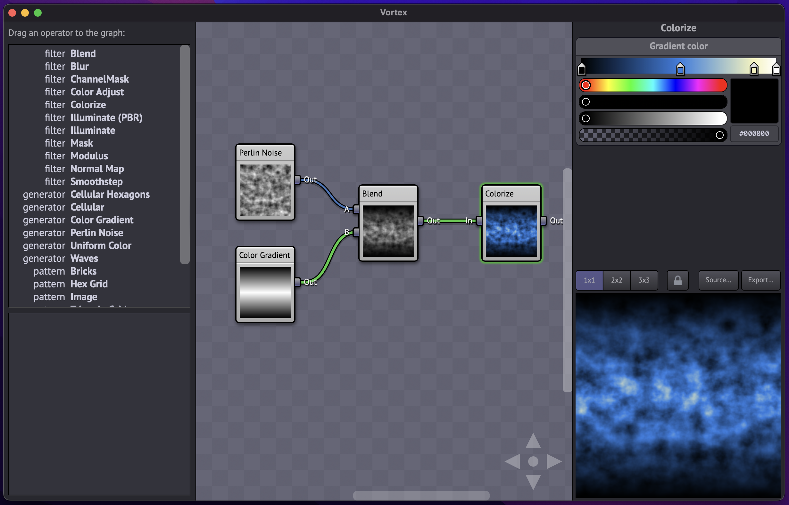

Vortex
======

Vortex is a texture generator application. It's intent is to make it easy to create seamlessly
tileable textures for use in 3D models.
0
The actual computation of the images is performed by the GPU using WebGL.

## Screenshot



<!-- More examples [here](./doc/Examples.md). -->

## Using the application

* To create new nodes, select an operator type from the table (on the left side panel) and
  click "Add".
* To get a detailed description of an operator, select that row in the operator table.
* To delete a node, select a node and then hit the delete key.
* Nodes can be connected via i/o terminals located on the left and right edges of the node.
  * Input terminals are on the left, output terminals are on the right.
  * Create connections by dragging between terminals.
  * You cannot connect an output to an output or an input to an input. Inputs must be connected
    to outputs.
  * Output nodes can have any number of connections, the signal is copied to all connected inputs.
  * Input nodes can only have one connection. Attempting to add another connection will replace
    the previous connection.
* When a node is selected, the node's property list will appear on the right panel.
* Node properties are shown as 'combo sliders' which are a combination of slider and text input,
  very similar to the controls in Blender 3D. You can click the arrows, drag left and right, or
  double-click to type in a numeric value directly.
* Editing gradients: Double-click to add or remove a color stop.
* Select the 'Shader' button on the left panel to view the text of the generated OpenGL shader.
* Select the 'Export' button to see a high-res version of the generated image for the current
  selected node.

## Running the application locally

Running in development mode:

```sh
npm install
npm run tauri dev
```

Then open [http://localhost:3005](http://localhost:3005) to view it in the browser.

## Development history:

### Vortex 3.0

Vortex is now a desktop application instead of a web app. It has been almost completely
re-written, and now uses Tauri, Solid and CSS modules.

### Vortex 2.0

This repository is a complete re-write of the original Vortex code. Changes:

* The biggest change is that Vortex 2.0 is much more focused on improving shader source
  code quality, as opposed to only caring about the images being exported. The hope is to
  make this a platform for general shader development.
* Migrated from Preact to React.
* Migrated from SASS to emotion.
* Converted most components from classes to functions.

### Vortex 1.0

The original Vortex, written using Preact.

## Articles

  * [The technology behind Vortex](https://medium.com/machine-words/the-technology-behind-vortex-a-real-time-browser-based-seamless-texture-generator-b18807fd8865)

## Credits

Vortex was written by Talin.

Vortex is heavily inspired by Holger Dammertz's NeoTextureEdit application. There are a number of
significant differences between the two programs, the biggest of which is the fact that Vortex has
been entirely rewritten in JavaScript and runs entirely in the browser.

## Looking for Contributions

I would be very interested in contributions for additional operator types.

Feel free to create a GitHub issue if you have an idea you'd like to see implemented.

### If you like Vortex, check out some of my other projects:

  * https://github.com/viridia
